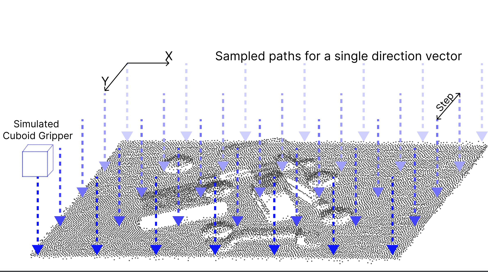

# Collision Avoidance Metrics for 3D Camera Evaluation



Accepted at CVPR Workshop 2024 (Vision and Language for Autonomous Driving and Robotics - VLADR)!

## Abstract
3D cameras have emerged as a critical source of information for applications in robotics and autonomous driving. These cameras provide robots with the ability to capture and utilize point clouds, enabling them to navigate their surroundings and avoid collisions with other objects. However, current standard camera evaluation metrics often fail to consider the specific application context. These metrics typically focus on measures like Chamfer distance (CD) or Earth Mover’s Distance (EMD), which may not directly translate to performance in real-world scenarios. To address this limitation, we propose a novel metric for point cloud evaluation, specifically designed to assess the suitability of 3D cameras for the critical task of collision avoidance. This metric incorporates application-specific considerations and provides a more accurate measure of a camera's effectiveness in ensuring safe robot navigation.

## This Repo
This repo contains the implementation of the Collision Avoidance Metrics. Example usage can be found in [example.py](example.py).

Example usage:

```sh
    python3 example.py <PATH-TO-QUERY-POINTCLOUD> <PATH-TO-GT-POINTCLOUD>
```

### Requirements

- Numpy
- Open3D
- OpenCV

### Owners
- vage@google.com
- dallolio@google.com

Copyright (c) Intrinsic Innovation LLC
All rights reserved.

This source code is licensed under the license found in the
LICENSE file in the root directory of this source tree.

